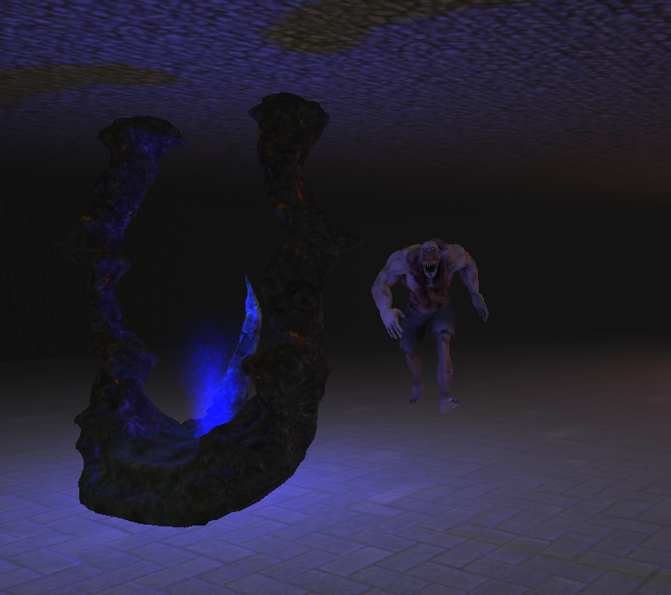

# OpenGL Horror Game (WIP)

This is a WIP for a still unnamed horror game and engine based on:
- SDL2
- OpenGL (3.3)
- OpenAL

Engine Features:
- Modern rendering pipeline (GLSL)
- Shadow mapping (with PCF)
- FXAA
- SSAO
- Multiple lights
- Simple rendering engine (OpenGL)
- Custom Collada parser (written in python)
- Custom OBJ / MTL importer
- Skeletal Animations
- UI with [Nuklear](https://github.com/vurtun/nuklear)
- OpenAL implementation
- Written in C (yes.. C! :D)
